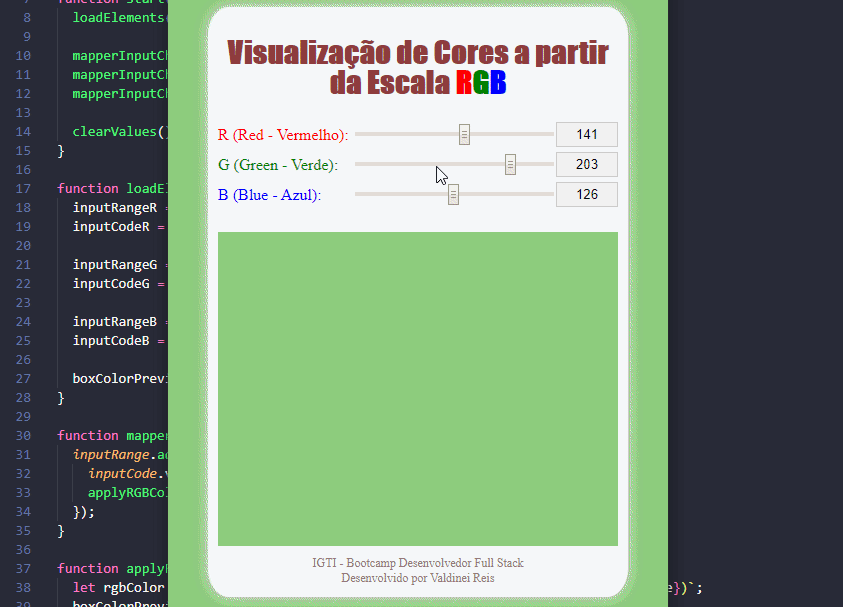

# rgb-color

## Exibição de Cores em RGB

Trabalho Prático do Módulo 1, do bootcamp Desenvolvedor Full Stack, oferecido pelo [IGTI](https://www.igti.com.br/).

## Descrição da atividade:

- Implementar, através de HTML, CSS e JavaScript puro, uma aplicação que contenha três inputs do tipo "range", cujos valores vão de 0 a 255 e representem, respectivamente, R (Red - Vermelho), G (Green - Verde) e B (Blue - Azul).
- Essa combinação de valores deve ser utilizada para preencher a cor de fundo de uma 
 quadrada.
- Além disso, inclua três inputs de texto somente-leitura (desabilitados) para a visualização do valor atual de cada input do tipo range.
- À medida em que o usuário modifica o valor dos ranges com as teclas ← e → do teclado, a 
 deve refletir a cor correspondente.

## Resultado da implementação

